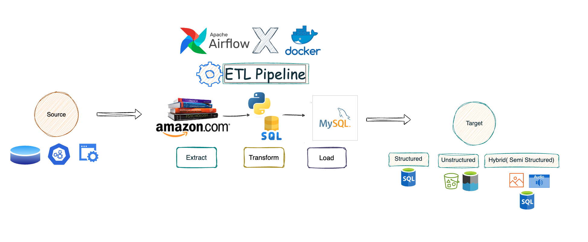

# Reference: End-to-End ETL Pipeline

## YouTube Channel
[Watch the tutorial](https://www.youtube.com/watch?v=3xyoM28B40Y&t=10s)

## Documentation
[Apache Airflow Official Documentation](https://airflow.apache.org/docs/apache-airflow/stable/howto/docker-compose/index.html) (Follow this if you are using Linux or Mac)

---

## Installation Instructions

### For Windows (PowerShell)

1. **Download the Docker Compose YAML file**:
   ```powershell
   Invoke-WebRequest -Uri "https://airflow.apache.org/docs/apache-airflow/2.9.1/docker-compose.yaml" -OutFile "docker-compose.yaml"
   ```

2. **Create necessary directories**:
   ```powershell
   New-Item -ItemType Directory -Force -Path ".\dags", ".\logs", ".\plugins", ".\config"
   "AIRFLOW_UID=50000" | Out-File -Encoding ASCII -FilePath .env
   ```

3. **Initialize Airflow**:
   ```powershell
   docker compose up airflow-init
   ```

4. **Start Airflow**:
   ```powershell
   docker compose up -d
   ```

5. **Check logs**:
   ```powershell
   docker compose logs -f
   ```

6. **Shut down Airflow**:
   ```powershell
   docker compose down
   ```

---

### For Linux/Mac

1. **Download the Docker Compose YAML file**:
   ```bash
   curl -LfO 'https://airflow.apache.org/docs/apache-airflow/2.9.1/docker-compose.yaml'
   ```
   
2. **make sure you have docker in your LINUX**:
   ```bash
   sudo apt install docker-compose
   ```
   
2. **Create necessary directories**:
   ```bash
   mkdir -p dags logs plugins config
   echo -e "AIRFLOW_UID=$(id -u)" > .env
   ```

3. **Initialize Airflow**:
   ```bash
   docker-compose up airflow-init
   ```

4. **Start Airflow**:
   ```bash
   docker-compose up -d
   ```

5. **Check logs**:
   ```bash
   docker-compose logs -f
   ```

6. **Shut down Airflow**:
   ```bash
   docker-compose down
   ```
